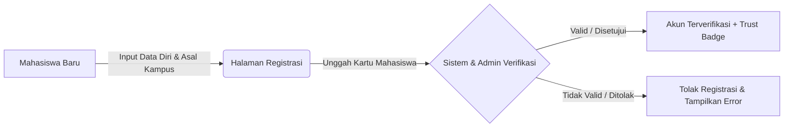
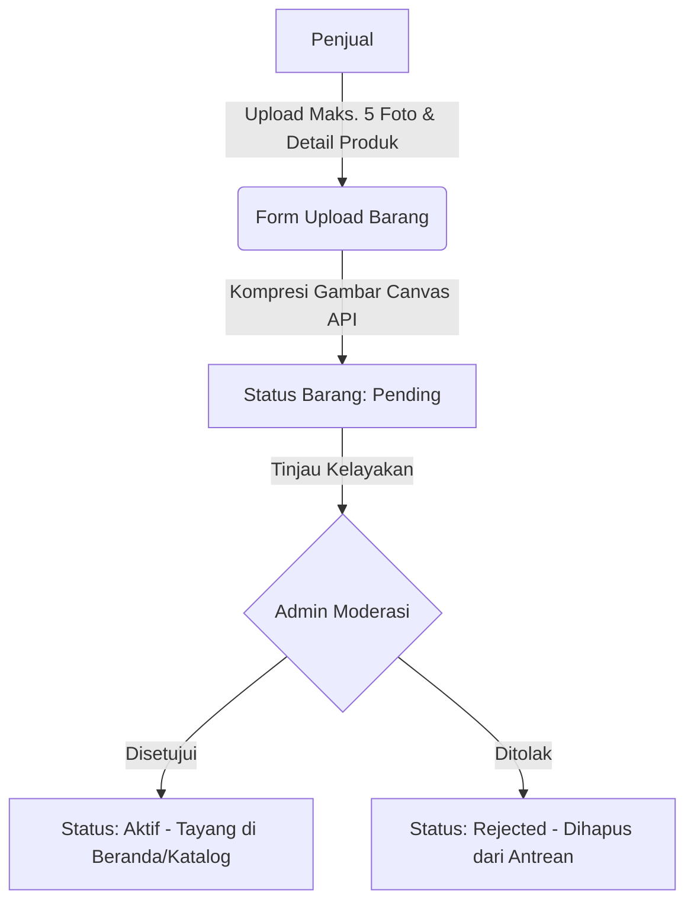
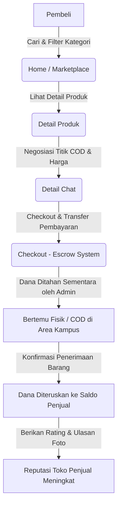
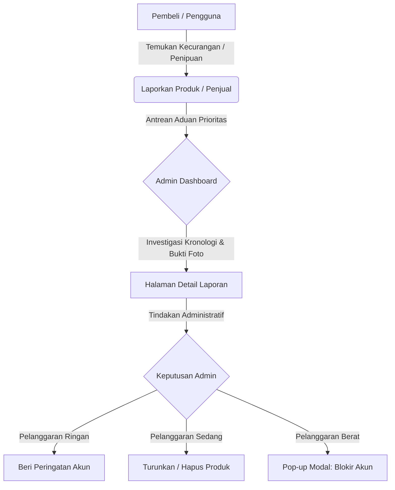

# Dokumentasi Prototype Antarmuka & Alur Kerja RE-KOST

Dokumen ini disusun untuk menjelaskan spesifikasi rancangan antarmuka (*prototype*), daftar berkas UI/UX (*artifacts*), serta alur kerja operasional (*workflows*) dari platform **RE-KOST**. Dokumentasi ini berfungsi sebagai panduan  serta referensi teknis bagi pengembang dalam memahami seluruh sistem yang telah diimplementasikan.

---

## 🚀 RE-KOST (Student-to-Student Marketplace Platform)
**RE-KOST** adalah platform e-marketplace terpercaya berbasis web/aplikasi yang dirancang khusus untuk komunitas mahasiswa. Platform ini memfasilitasi mahasiswa untuk melakukan jual-beli barang bekas kos (*pre-loved*) berkualitas—seperti elektronik, furnitur kamar kos, buku kuliah, hingga peralatan memasak—secara aman, hemat, dan ramah lingkungan di ekosistem kampus.

---

## 🛠️ 1. Fitur Utama Platform

### A. Sisi Pengguna (Mahasiswa)
* **Registrasi & Verifikasi Kampus**: Pendaftaran akun menggunakan email mahasiswa resmi dengan deteksi identitas otomatis (*Trust Badge*) untuk memastikan komunitas yang aman dari pihak luar.
* **Upload & Manajemen Barang**: Modul bagi penjual untuk mengunggah barang bekas kos lengkap dengan deskripsi, kategori, penentuan harga, lokasi boarding/kampus terdekat, serta status item (*Aktif*, *Terjual*, *Draft*).
* **Sistem Chat & Negosiasi**: Fitur komunikasi real-time antar-mahasiswa untuk menanyakan detail kondisi barang atau melakukan negosiasi harga (*Nego Halus*) sebelum melakukan pertemuan fisik (COD).
* **Checkout & Pembayaran Terintegrasi**: Proses transaksi yang mendukung metode pembayaran digital (GoPay, OVO, Bank Transfer) dengan sistem penahanan dana otomatis (*escrow*) demi keamanan transaksi.
* **Sistem Ulasan & Feedback**: Mahasiswa dapat memberikan rating bintang dan ulasan foto setelah transaksi selesai untuk membangun reputasi dan tingkat kepercayaan (*trust*) penjual.
* **Pengaturan Kustomisasi**: Fitur penyesuaian tampilan aplikasi yang mendukung peralihan tema *Light Mode* (Tema Terang) dan *Dark Mode* (Tema Gelap).

### B. Sisi Admin Panel
* **Dashboard Overview**: Halaman ringkasan statistik real-time mengenai total pengguna aktif, produk aktif, total produk terjual, grafik pertumbuhan pendapatan (*revenue growth*), serta total laporan komplain masuk.
* **Kelola User**: Manajemen basis data pengguna untuk memantau status keaktifan akun mahasiswa, memverifikasi *Trust Badge*, atau membekukan/memblokir akun yang melanggar ketentuan platform.
* **Kelola Produk**: Pemantauan inventaris barang kos yang sedang tayang, dengan otoritas administratif untuk mengubah status produk menjadi *Aktif*, *Pending*, atau *Nonaktif*.
* **Kelola Transaksi**: Pencatatan dan monitoring arus keuangan serta pelacakan status setiap nomor transaksi (*Selesai*, *Diproses*, *Pending*, *Dibatalkan*).
* **Kelola Laporan & Komplain**: Sistem mitigasi penipuan atau ketidaksesuaian produk berdasarkan laporan pengguna dengan tingkat urgensi tertentu (*High*, *Medium*, *Low Priority*), dilengkapi dengan tombol tindakan administratif (*Beri Peringatan*, *Hapus Produk*, *Blokir Akun*).

---

## 📂 2. Daftar 31 Berkas Rancangan Antarmuka (UI/UX Artifacts)

### A. Sisi Aplikasi Pengguna (20 File Rancangan)
#### 🔑 Kelompok Autentikasi & Profil
1. **Registrasi Akun RE-KOST (Updated)** — Form pendaftaran akun mahasiswa baru lengkap dengan data asal kampus.
2. **Profil RE-KOST** — Halaman utama dasbor profil mahasiswa (menampilkan status *Trust Badge* dan pintasan toko).
3. **Edit Profil** — Formulir pembaruan data diri, nomor telepon, alamat kos, dan verifikasi asal kampus.
4. **Pengaturan Tema RE-KOST** — Fitur kustomisasi antarmuka untuk beralih antara tema terang (*Light Mode*) dan gelap (*Dark Mode*).
5. **Barang Favorit RE-KOST** — Daftar produk incaran yang disimpan oleh pembeli untuk transaksi mendatang.

#### 🔍 Kelompok Eksplorasi & Katalog Produk
6. **Home RE-KOST** — Beranda utama aplikasi yang menampilkan banner promo, filter pencarian, dan daftar barang terbaru.
7. **Semua Barang RE-KOST** — Katalog seluruh produk lengkap dengan fitur sortir harga dan pencarian.
8. **Kategori Produk RE-KOST** — Filter produk kos berdasarkan kategori spesifik (Elektronik, Perabotan, Dapur, Buku, Pakaian, Lainnya).
9. **Detail Produk RE-KOST** — Halaman detail yang menampilkan spesifikasi, foto, deskripsi, lokasi kos, reputasi penjual, dan tombol chat/beli.

#### 💬 Kelompok Komunikasi & Toko Penjual
10. **Chat RE-KOST** — Daftar masuk pesan obrolan (*Inbox messages*) pembeli dan penjual.
11. **Detail Chat RE-KOST** — Ruang pesan interaktif untuk negosiasi barang, detail COD, dan tawar-menawar harga.
12. **View Toko RE-KOST** — Tampilan profil toko milik penjual lain saat dikunjungi oleh pengguna, menampilkan rating toko.

#### 📦 Kelompok Sistem Manajemen Penjual
13. **Upload Barang RE-KOST** — Formulir input foto produk, nama barang, harga, kategori, deskripsi, dan lokasi kos.
14. **Berhasil Upload RE-KOST** — Halaman konfirmasi sukses setelah penjual mengirimkan data barang jualan.
15. **Barang yang Dijual RE-KOST** — Dasbor inventaris penjual untuk melacak status barang jualan (*Aktif*, *Terjual*, *Draft*).

#### 💳 Kelompok Transaksi & Ulasan
16. **Checkout RE-KOST** — Rincian produk, metode pembayaran, rincian biaya, dan lokasi penyerahan barang (COD).
17. **Pesanan Berhasil RE-KOST** — Halaman konfirmasi pembayaran sukses dari pembeli.
18. **Riwayat Transaksi RE-KOST** — Pencatatan status transaksi belanja pengguna (Pembelian & Penjualan).
19. **Beri Ulasan Produk RE-KOST** — Formulir pemberian rating bintang dan ulasan foto pasca transaksi selesai.

#### 🔔 Kelompok Sistem Informasi
20. **Notifikasi RE-KOST** — Pusat pemberitahuan aktivitas sistem (pesan chat baru, status verifikasi barang, status pesanan).

---

### B. Sisi Admin Panel Back-End (11 File Rancangan)
1. **Html → Body** — Halaman login gerbang masuk (Admin Panel) menggunakan kredensial administrator.
2. **Html → Body-1** — *Dashboard Overview* berisi statistik pengguna, produk aktif, total transaksi, serta grafik pendapatan platform.
3. **Html → Body-2** — Menu *Kelola User* berisi tabel database status akun mahasiswa (Aktif, Blokir, Menunggu Verifikasi).
4. **Html → Body-3** — Menu *Kelola Produk* berisi daftar moderasi produk kos (Ubah status ke: Aktif, Pending, Nonaktif).
5. **Html → Body-4** — Menu *Kelola Transaksi* berisi monitoring arus keuangan platform dan detail pelacakan transaksi harian.
6. **Html → Body-5** — Menu *Kelola Laporan & Komplain* berisi daftar aduan sengketa transaksi berdasarkan skala prioritas (*High/Medium/Low*).
7. **Html → Body-6** — Halaman pilihan peran masuk (*Masuk Sebagai: Mahasiswa / Admin*).
8. **Html → Body-7** — Halaman *Detail Laporan & Komplain* menampilkan bukti foto sengketa, kronologi aduan, dan tombol aksi moderator.
9. **Html → Body-8** — Tampilan *Pop-up Modal Blokir Akun* untuk memilih durasi sanksi dan mengisi alasan pemblokiran pengguna.
10. **Html → Body-9** — *Log Aktivitas & Detail Laporan Kasus* khusus laporan barang tidak sesuai (#REP-8821).
11. **Html → Body-10** — *Log Aktivitas & Detail Kasus Fasifikasi Properti/Fasilitas* khusus laporan pelanggaran serius (#RPT-88219).

---

## 🔄 3. Alur Kerja Sistem (System Workflows)

### A. Alur Pendaftaran & Verifikasi Akun (Onboarding Workflow)
Alur ini dirancang untuk memastikan bahwa seluruh pengguna dalam komunitas RE-KOST adalah mahasiswa aktif yang sah.

1. **Registrasi**: Pengguna baru mendaftarkan akun di halaman *Registrasi Akun* dengan mengisi nama lengkap, nomor WhatsApp, asal kampus, lokasi kos, dan kata sandi.
2. **Pemberian Akses**: Setelah dokumen tervalidasi oleh sistem/admin sebagai mahasiswa aktif, pengguna mendapatkan status *Verified Student* dan lencana *Trust Badge* otomatis pada profilnya untuk meningkatkan rasa aman dalam komunitas transaksi.

---

### B. Alur Pengunggahan & Verifikasi Produk (Sellers & Admin Curation Workflow)
Alur kurasi ini membatasi penayangan barang kos ilegal, rusak, atau terindikasi penipuan.

1. **Pengunggahan Produk**: Penjual masuk ke halaman *Upload Barang*, mengunggah foto produk (maksimal 5), mengisi nama barang, kategori, harga, deskripsi (minimal 20 karakter), serta lokasi kampus terdekat.
2. **Penahanan Status**: Setelah menekan tombol kirim, halaman *Berhasil Upload* akan muncul. Status barang tersebut berada dalam kondisi **Pending** dan belum muncul di halaman publik.
3. **Verifikasi Admin**: Admin membuka modul *Kelola Produk* pada Admin Panel dan meninjau data produk untuk memastikan foto dan deskripsi aman serta bebas dari penipuan.
4. **Penerbitan Produk**: Jika disetujui, status produk berubah menjadi **Aktif**. Produk resmi diterbitkan dan dapat diakses oleh publik pada halaman beranda maupun filter kategori.

---

### C. Siklus Jual-Beli & Transaksi Barang (Buyers Workflow - End to End)
Siklus jual-beli barang kos dari pencarian awal hingga penyelesaian transaksi.

1. **Pencarian Produk**: Pembeli menjelajahi produk di halaman beranda (*Home*) atau katalog *Semua Barang*. Pembeli dapat masuk ke halaman *Detail Produk* untuk meninjau deskripsi lengkap dan perkiraan lokasi.
2. **Proses Negosiasi**: Pembeli membuka fitur *Chat* untuk berdiskusi secara real-time mengenai kondisi riil barang, kesepakatan harga akhir (*Nego Halus*), serta menentukan titik temu ketemuan (COD) di area kampus.
3. **Checkout & Pembayaran**: Pembeli masuk ke halaman *Checkout* untuk meninjau ringkasan produk, rincian biaya, dan memilih metode pembayaran. Sistem memberikan proteksi berupa penahanan dana pembeli untuk sementara waktu (*Escrow System*).
4. **Notifikasi Sistem**: Setelah pembayaran sukses, halaman *Pembayaran Berhasil* akan muncul, dan sistem secara otomatis mengirimkan pemberitahuan ke modul *Notifikasi* masing-masing pengguna.
5. **Penyelesaian Transaksi (COD)**: Pembeli dan penjual bertemu secara fisik di titik COD area kampus untuk melakukan serah terima barang bekas kos. Setelah pembeli memastikan barang sesuai, pembeli melakukan konfirmasi penerimaan di aplikasi. Status di *Riwayat Transaksi* berubah menjadi *Selesai*, dan dana diteruskan ke saldo penjual.
6. **Ulasan Produk**: Pembeli mengisi halaman *Beri Ulasan* berupa pemberian rating bintang (1-5) dan ulasan foto opsional sebagai feedback reputasi toko penjual.

---

### D. Alur Pengawasan & Resolusi Masalah (Admin Moderation Workflow)
Sistem pengawasan untuk menangani laporan kecurangan atau penipuan.

1. **Pelaporan Masalah**: Jika ditemukan barang yang tidak sesuai deskripsi/foto saat COD atau terindikasi penipuan, pengguna dapat melaporkan produk tersebut. Laporan ini otomatis masuk ke antrean *Kelola Laporan & Komplain* di Admin Panel berdasarkan skala prioritas (*High/Medium/Low*).
2. **Investigasi Admin**: Admin membuka halaman *Detail Laporan & Komplain* untuk memeriksa ID Laporan, kronologi masalah dari pelapor, serta memvalidasi bukti-bukti foto sengketa yang dilampirkan pelapor.
3. **Eksekusi Tindakan Administratif**: Berdasarkan hasil investigasi, admin mengambil tindakan langsung melalui panel kontrol:
   * **Beri Peringatan**: Mengirimkan teguran resmi sistem ke akun penjual.
   * **Hapus Produk**: Menurunkan paksa listing produk dari halaman publik agar tidak dapat dibeli lagi.
   * **Blokir Akun**: Jika terbukti melakukan pelanggaran berat, admin membuka pop-up *Blokir Akun* untuk membekukan akses pengguna secara sementara (7 hari, 30 hari) atau permanen berdasarkan alasan yang logis.

---

## 🎨 4. Spesifikasi Desain & Preferensi Antarmuka
* **Prinsip UI/UX**: Menggunakan pendekatan antarmuka yang bersih (*clean*), modern, dan minimalis yang berorientasi pada kenyamanan navigasi perangkat seluler mahasiswa (*Mobile-First Design*).
* **Aksesibilitas Adaptif**: Implementasi fitur kustomisasi kenyamanan visual bagi pengguna lewat komponen halaman *Pengaturan Tema* yang mendukung pilihan *Light Mode* (tampilan cerah dan bersih) maupun *Dark Mode* (menghemat baterai & nyaman di malam hari).

---
*README ini disusun secara terstruktur sebagai dokumentasi pelengkap teknis dari 31 berkas prototype aplikasi RE-KOST.*

