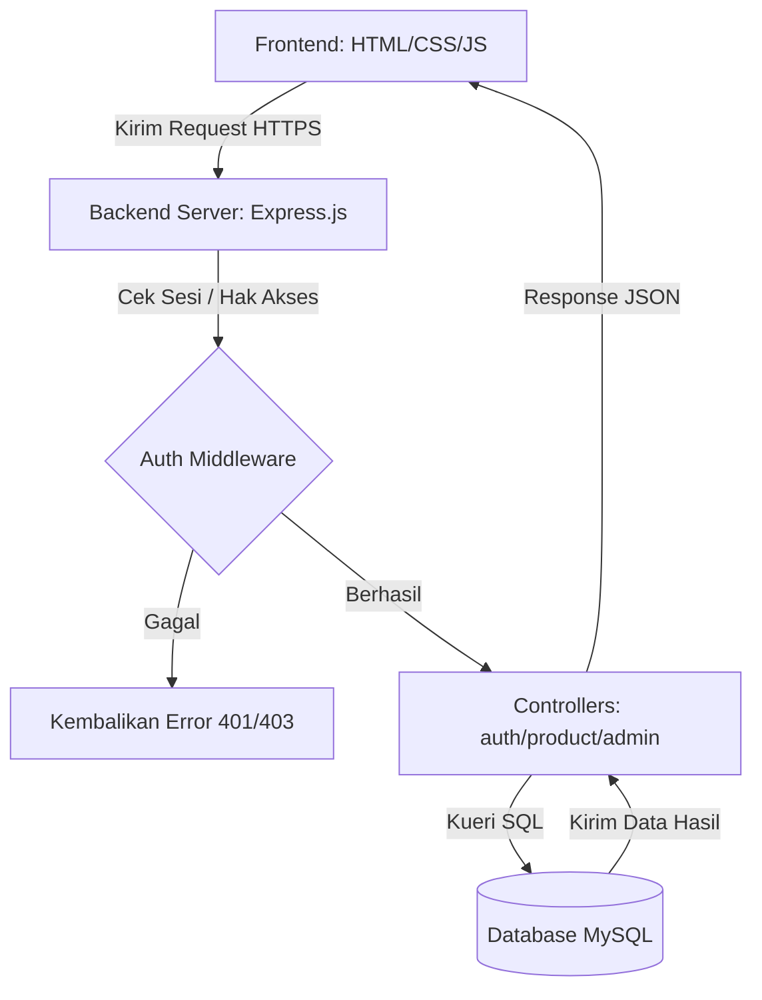

# 🚀 RE-KOST — Pasar Anak Kos

Selamat datang di repositori **RE-KOST**.
**RE-KOST** adalah platform marketplace berbasis web yang dirancang khusus untuk memenuhi kebutuhan mahasiswa yang tinggal di kos. Dengan slogan *"Dari Mahasiswa, Untuk Mahasiswa"*, platform ini menjadi solusi praktis untuk bertransaksi barang bekas berkualitas, jasa angkut barang, hingga kebutuhan kos harian secara aman dan mudah.

---

## 📋 Daftar Isi
1. [Fitur Utama](#-fitur-utama)
2. [Teknologi yang Digunakan (Tech Stack)](#-teknologi-yang-digunakan-tech-stack)
3. [Struktur Repositori](#-struktur-repositori)
4. [Petunjuk Penggunaan Frontend (Uji Coba Statis)](#-petunjuk-penggunaan-frontend-uji-coba-statis)
5. [Petunjuk Konfigurasi Backend & Database](#-petunjuk-konfigurasi-backend--database)
6. [Arsitektur Alur Sistem](#%EF%B8%8F-arsitektur-alur-sistem)
7. [Kontributor & Lisensi](#-kontributor--lisensi)

---

## ✨ Fitur Utama

### 1. Panel Pengguna (User Area)
* **Landing Page (`index.html`)**: Halaman utama interaktif yang menampilkan profil singkat RE-KOST, promosi terbaru, serta ajakan untuk bergabung.
* **Autentikasi Pintar (`login.html` & `register.html`)**: Pendaftaran akun khusus mahasiswa dengan pengisian data terverifikasi.
* **Dashboard Utama (`dashboard.html`)**: Pusat aktivitas pengguna yang dilengkapi dengan pencarian barang, banner promo, filter kategori cepat, dan rekomendasi barang berkualitas.
* **Marketplace (`marketplace.html`)**: Katalog lengkap semua barang yang dijual, lengkap dengan fitur pencarian dan penyaringan kategori.
* **Detail Produk (`product-detail.html`)**: Informasi mendalam seputar barang (harga, deskripsi, kondisi, lokasi kos/kampus penjual, ulasan pembeli) beserta tombol negosiasi via chat atau langsung membeli.
* **Upload Produk (`Page_1/sell-product.html`)**: Formulir interaktif bagi penjual untuk mengunggah barang. Memiliki **fitur kompresi gambar otomatis (Canvas API)** untuk mengurangi ukuran gambar hingga lebar maksimal 600px sebelum disimpan di LocalStorage, menghindari kuota penyimpanan penuh.
* **Riwayat & Favorit (`Page_1/favorites.html`, `Page_1/my-products.html`)**: Manajemen produk yang disukai dan produk yang sedang dijual oleh pengguna.
* **Sistem Chat Real-time (`chat.html` & `chat-room.html`)**: Fitur komunikasi langsung pembeli-penjual untuk COD atau tawar-menawar barang.
* **Notifikasi (`notifications.html`)**: Halaman pemberitahuan untuk chat masuk, status pesanan, atau konfirmasi pembayaran.
* **Checkout & Pembayaran (`checkout.html` & `payment.html`)**: Alur pembelian barang kos dengan pengisian alamat kos detail dan pilihan metode pembayaran (E-Wallet, Transfer Bank, atau COD).

### 2. Panel Admin (Admin Area)
Terletak pada folder `Admin/`, area ini dirancang dengan gaya modern untuk manajemen platform:
* **Admin Dashboard (`Admin/dashboard.html`)**: Visualisasi data statistik pengguna, produk aktif, total transaksi, dan laporan masuk.
* **Manajemen Pengguna (`Admin/users.html`)**: Melihat, memverifikasi status mahasiswa, dan mengelola akun yang terdaftar.
* **Manajemen Produk (`Admin/products.html`)**: Melakukan verifikasi kelayakan produk sebelum tampil di marketplace umum.
* **Riwayat Transaksi (`Admin/transactions.html`)**: Memantau seluruh transaksi yang berhasil, tertunda, atau dibatalkan.
* **Laporan Dispute/Aduan (`Admin/reports.html`)**: Menangani laporan penipuan atau barang tidak sesuai dari pembeli untuk menjaga keamanan platform.

---

## 🛠️ Teknologi yang Digunakan (Tech Stack)

### Frontend (Client-Side)
* **HTML5**: Struktur halaman yang semantik dan ramah SEO.
* **Vanilla CSS3**: Styling premium dengan font modern *Outfit* dari Google Fonts, efek *Glassmorphism* (latar belakang buram transparan), gradasi warna pastel dinamis, serta layout responsif (Flexbox & Grid).
* **Vanilla JavaScript (ES6+)**: Logika interaksi klien, penanganan form, manipulasi DOM, integrasi data sementara melalui `LocalStorage`, dan kompresi gambar otomatis menggunakan HTML5 Canvas.

### Backend (Server-Side - Blueprint Setup)
* **Node.js & Express.js**: Struktur backend yang terorganisasi menggunakan pola arsitektur MVC (Model-View-Controller) dengan router modular untuk masa pengembangan berikutnya.

### Database
* **MySQL/PostgreSQL**: Kerangka skema database relational untuk relasi antara user, produk, transaksi, dan pesan chat.

---

## 📂 Struktur Repositori

```bash
Web_Rekost paling terbaru/Web_Rekost/
│
├── Admin/                          # Halaman antarmuka khusus Administrator
│   ├── dashboard.html              # Ringkasan statistik dan aktivitas admin
│   ├── notifications.html          # Notifikasi sistem untuk admin
│   ├── products.html               # Manajemen verifikasi produk jualan
│   ├── reports.html                # Laporan aduan pelanggaran/masalah transaksi
│   ├── transactions.html           # Riwayat dan manajemen status transaksi
│   └── users.html                  # Manajemen akun mahasiswa terdaftar
│
├── Page_1/                         # Halaman tambahan interaksi pengguna
│   ├── favorites.html              # Menyimpan daftar produk favorit
│   ├── my-products.html            # Daftar produk yang diunggah oleh pengguna
│   ├── my-purchases.html           # Riwayat transaksi pembelian pengguna
│   ├── sell-product.html           # Form upload produk jualan baru
│   └── upload-success.html         # Halaman sukses setelah upload barang
│
├── Backend/                        # Kode sumber sisi server (Express.js)
│   ├── Config/                     # Konfigurasi koneksi database
│   │   └── db.js
│   ├── Controllers/                # Logika bisnis (pengolahan request & response)
│   │   ├── adminController.js
│   │   ├── authController.js
│   │   ├── productController.js
│   │   ├── reportController.js
│   │   ├── serController.js        # Controller profil seller / penjual
│   │   └── transactionController.js
│   ├── Models/                     # Representasi data (Skema database)
│   ├── Routes/                     # Pintu masuk API endpoint
│   │   ├── Admin/                  # API khusus admin
│   │   ├── authRoute.js            # API registrasi & login
│   │   ├── chatRoute.js            # API pengiriman pesan chat
│   │   ├── productRoute.js         # API crud produk
│   │   └── transactionRoute.js     # API pembayaran & transaksi
│   ├── middleware/                 # Validasi sesi token & otorisasi
│   │   ├── adminMiddleware.js
│   │   └── authMiddleware.js
│   └── server.js                   # Entry point aplikasi backend
│
├── Css/                            # Kumpulan lembar gaya (Styling) website
│   ├── Admin/                      # CSS khusus halaman admin
│   │   ├── admin-dashboard.css
│   │   ├── admin.css
│   │   ├── checkout.css
│   │   ├── favorites.css
│   │   ├── my-products.css
│   │   └── payment.css
│   ├── auth.css                    # CSS login & register
│   ├── chat.css                    # CSS tampilan ruang obrolan
│   ├── dashboard.css               # CSS halaman beranda utama mahasiswa
│   ├── edit-profile.css            # CSS edit profil pengguna
│   ├── main.css                    # Aturan CSS dasar & variabel warna global
│   ├── marketplace.css             # CSS halaman daftar katalog marketplace
│   ├── notifications.css           # CSS halaman list notifikasi
│   ├── payment.css                 # CSS halaman transaksi pembayaran
│   ├── product-detail.css          # CSS halaman informasi produk detail
│   ├── product.css                 # CSS pendukung manajemen produk
│   └── profile.css                 # CSS halaman tampilan profil pengguna
│
├── Database/                       # Berkas database
│   └── schema.sql                  # Skema tabel database relasional
│
├── Js/                             # Logika pemrograman frontend (JavaScript)
│   ├── Admin/                      # JavaScript pendukung panel admin
│   ├── admin-auth.js               # Autentikasi hak akses administrator
│   ├── api.js                      # Pengaturan basis URL Fetch API
│   ├── auth.js                     # Logika login, registrasi, & logout
│   ├── chat.js                     # Penanganan chat room pembeli & penjual
│   ├── checkout.js                 # Pemrosesan form checkout belanjaan
│   ├── dashboard.js                # Pengaturan beranda & event handler
│   ├── favorid.js                  # Logika simpan / hapus favorit
│   ├── marketplace.js              # Fitur filter & pencarian barang kos
│   ├── payment.js                  # Proses transaksi & upload bukti bayar
│   ├── product.js                  # Logika aksi pada kartu produk
│   ├── search.js                   # Pencarian global
│   └── upload.js                   # Logika penanganan input & kompresi foto
│
├── utils/                          # Fungsi pembantu (utility)
│   ├── helpers.js                  # Format mata uang Rp, format tanggal
│   └── validation.js               # Validasi input form
│
├── admin-login.html                # Akses login untuk administrator
├── chat-room.html                  # Halaman ruang obrolan aktif pembeli-penjual
├── chat.html                       # Halaman daftar obrolan masuk
├── checkout.html                   # Form checkout pesanan
├── dashboard.html                  # Halaman beranda utama setelah pengguna login
├── edit-profile.html               # Pengaturan profil & foto pengguna
├── index.html                      # Halaman landing utama RE-KOST (sebelum login)
├── login.html                      # Halaman masuk untuk pengguna mahasiswa
├── marketplace.html                # Katalog lengkap produk barang kos
├── notifications.html              # Riwayat notifikasi masuk
├── payment.html                    # Pilihan metode bayar & instruksi transfer
├── product-detail.html             # Tampilan detail spesifikasi produk
├── profile.html                    # Profil personal & pintasan toko jualan
├── register.html                   # Form pendaftaran akun mahasiswa baru
└── seller-profile.html             # Profil penjual saat dilihat pengguna lain
```

---

## 🏃‍♂️ Cara Menjalankan Program

Untuk menjalankan proyek **RE-KOST**, Anda dapat memilih salah satu dari dua cara berikut, tergantung kebutuhan Anda:

### 💡 Cara 1: Menjalankan Frontend Saja (Uji Coba Tampilan / Demo Statis)
Cara ini paling mudah jika Anda hanya ingin melihat tampilan desain, tata letak, dan interaksi antarmuka (UI/UX) website secara offline.
1. **Gunakan Ekstensi VS Code (Sangat Direkomendasikan)**:
   * Buka folder `Web_Rekost paling terbaru/Web_Rekost` di VS Code.
   * Instal ekstensi **Live Server** (oleh Ritwick Dey).
   * Klik kanan pada berkas `index.html` dan pilih **Open with Live Server**.
   * Halaman website akan terbuka otomatis di browser Anda (biasanya di alamat sebagai contoh`http://127.0.0.1:5500/index.html`).
2. **Cara Alternatif (Langsung)**:
   * Masuk ke folder `Web_Rekost paling terbaru/Web_Rekost`.
   * Klik ganda berkas `index.html` untuk langsung membukanya di browser peramban Anda.
   * *Catatan: Beberapa aset gambar atau tautan lokal mungkin membutuhkan web server (seperti Live Server) agar transisi halaman berjalan maksimal.*

---

### 🖥️ Cara 2: Menjalankan Aplikasi Secara Fullstack (Frontend + Backend + Database)
Gunakan cara ini jika Anda ingin mengaktifkan logika penyimpanan database, autentikasi dinamis, riwayat data, dan sistem chat real-time.

#### Langkah 1: Persiapan Database MySQL
1. Buka aplikasi database manager pilihan Anda (seperti **phpMyAdmin**, **DBeaver**, **HeidiSQL**, dll.).
2. Buat database baru dengan nama `db_rekost`.
3. Buka dan salin kueri di dalam berkas `Web_Rekost paling terbaru/Web_Rekost/Database/schema.sql` (bila sudah diisi skemanya), lalu jalankan/eksekusi kueri tersebut pada database `db_rekost` untuk membuat seluruh tabel yang diperlukan.

#### Langkah 2: Konfigurasi Backend Express.js
1. Buka terminal atau Command Prompt baru, lalu navigasikan ke folder Backend:
   ```bash
   cd "Web_Rekost paling terbaru/Web_Rekost/Backend"
   ```
2. Inisialisasi package manager dan pasang seluruh dependensi Node.js yang diperlukan:
   ```bash
   npm init -y
   npm install express mysql2 dotenv cors bcryptjs jsonwebtoken
   npm install --save-dev nodemon
   ```
3. Buat berkas baru bernama **`.env`** di dalam folder `Web_Rekost paling terbaru/Web_Rekost/Backend/` dan isi dengan konfigurasi kredensial database Anda:
   ```env
   PORT=5000
   DB_HOST=localhost
   DB_USER=root
   DB_PASSWORD=isi_dengan_password_database_anda
   DB_NAME=db_rekost
   JWT_SECRET=rahasia_jwt_super_aman_anda
   ```
4. Tambahkan konfigurasi skrip start pada berkas `package.json` di dalam folder `Web_Rekost paling terbaru/Web_Rekost/Backend/` agar bisa berjalan di mode development (nodemon):
   ```json
   "scripts": {
     "start": "node server.js",
     "dev": "nodemon server.js"
   }
   ```

#### Langkah 3: Menjalankan Server Backend
1. Jalankan perintah berikut di dalam terminal folder Backend Anda:
   ```bash
   npm run dev
   ```
2. Jika berhasil, server akan berjalan di port `5000` (contoh: `Server running on port 5000`).

#### Langkah 4: Hubungkan Frontend ke Backend
1. Konfigurasikan file `Web_Rekost paling terbaru/Web_Rekost/Js/api.js` untuk mengarahkan basis URL Fetch API ke alamat server backend lokal (misal: `const BASE_URL = 'http://localhost:5000/api';`).
2. Jalankan berkas `index.html` menggunakan **Live Server** seperti pada Cara 1.
3. Sekarang, interaksi form (Login, Register, Upload Barang) akan mengirimkan data langsung ke Server Backend dan menyimpannya di Database MySQL Anda!

## 🔄 Arsitektur Alur Sistem

Berikut adalah representasi visual dari bagaimana antarmuka pengguna (Frontend) berkomunikasi dengan database melalui perantara server API (Backend):



---

## 📄 Kontributor & Lisensi
* **Hak Cipta**: Proyek RE-KOST — Dirancang untuk memenuhi solusi kebutuhan komunitas mahasiswa kos secara digital.
* **Lisensi**: MIT License. Bebas dikembangkan dan dimodifikasi untuk tujuan akademis maupun komersial skala kecil.

